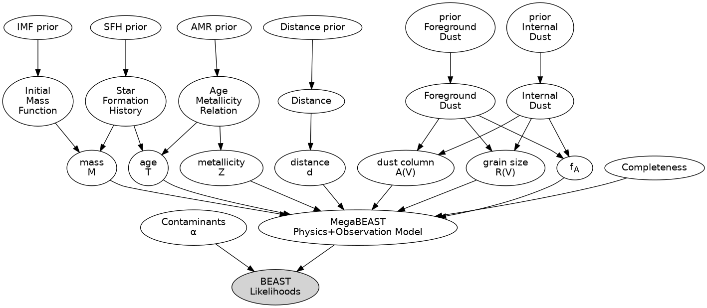
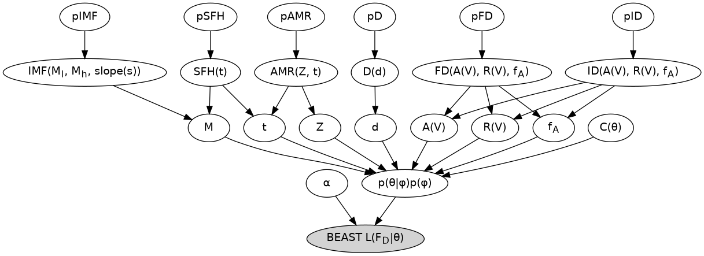

.. _megabeast_graphical_model:

################
Graphical Models
################

A graphical model is useful to visualize how the MegaBEAST is structured and works.

For the graphical models of the BEAST see <https://beast.readthedocs.io/en/latest/beast_graphical_model.html>.

Text version
============

Generated with the `python megabeast/plotting/plot_graphic_model`.

Math version
============

Generated with the `python megabeast/plotting/plot_graphic_model`.
